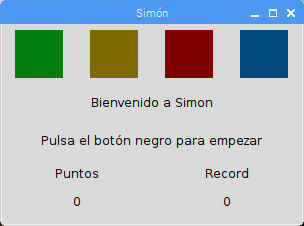
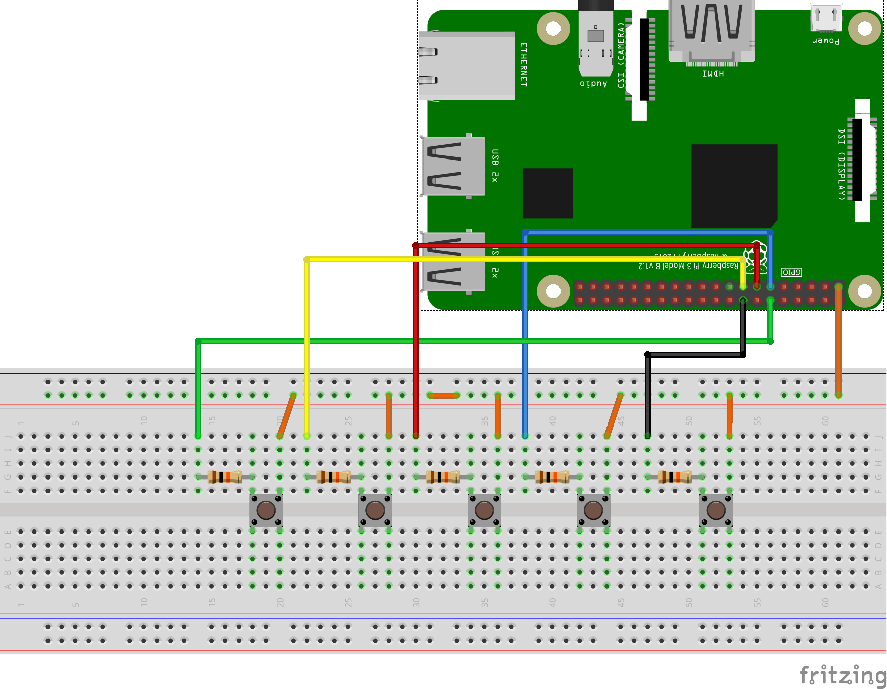

# Simon - Raspberry

## Español

### Descripción

Juego Simon para Raspberry Pi, programado con Python (versión 3).
Se muestra en una ventana usando Tkinter ([Tkinter](https://wiki.python.org/moin/TkInter)) y se controla con pulsadores conectados a la GPIO mediante RPi.GPIO ([RPi.GPIO](https://pypi.org/project/RPi.GPIO/))

[Simon en www.guitxo.com](https://www.guitxo.com/2019/04/28/simon-con-raspberry-pi/)

## English

### Description

Game Simon for Raspberry Pi, programmed with Python (version 3).
It shows a window using Tkinter ([Tkinter](https://wiki.python.org/moin/TkInter)) and controled with push buttons connected to GPIO through RPi.GPIO ([RPi.GPIO](https://pypi.org/project/RPi.GPIO/))

[Simon in www.guitxo.com](https://www.guitxo.com/2019/04/28/simon-con-raspberry-pi/)

